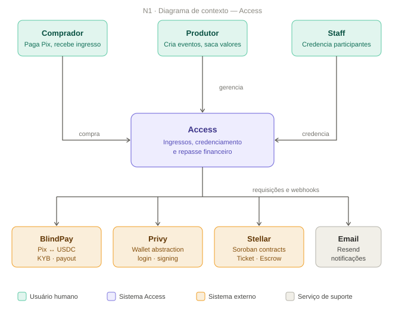
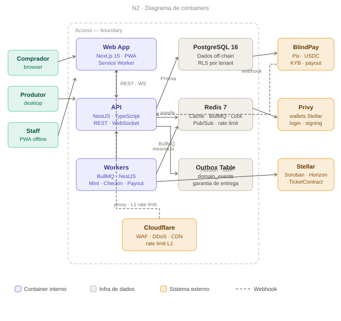
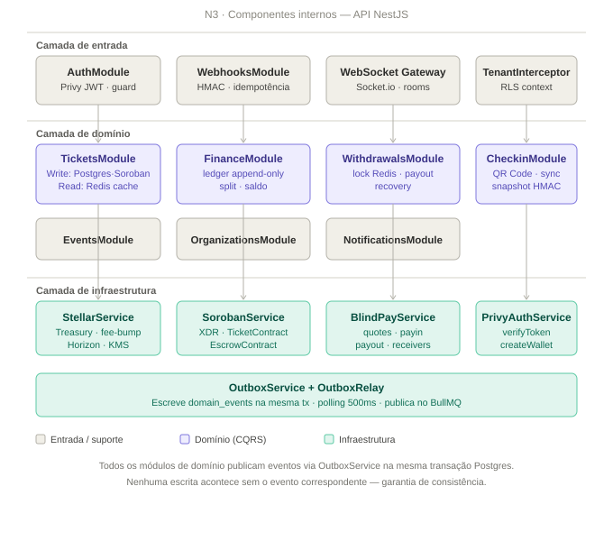

# Arquitetura C4 — Access

> ⚠️ **Documento anterior à revisão de arquitetura de 20/08/2026.** Parte do conteúdo está
> superada (escrow, Treasury própria, KMS, CQRS, WebSocket). Em qualquer conflito, vale o
> [`MVP-REVISADO.md`](../06-sdd/MVP-REVISADO.md). Será revisado junto com as SPECs de cada bloco.

Diagramas como SVG estático em `docs/02-project/diagrams/` — renderizam corretamente no GitHub, no VS Code e em qualquer visualizador, sem depender de motor de renderização de terceiros.

---

## N1 — Diagrama de Contexto

Mostra o sistema como uma caixa preta e seus relacionamentos com usuários e sistemas externos.

**Leitura:** os três usuários humanos (Comprador, Produtor, Staff) interagem exclusivamente com o sistema Access. O sistema, por sua vez, orquestra três parceiros externos (BlindPay, Privy, Stellar/Soroban) e um serviço de suporte (Email). Nenhum usuário interage diretamente com os sistemas externos — toda a complexidade de blockchain e pagamento fica encapsulada atrás do Access.

---

## N2 — Diagrama de Containers

Mostra os containers (aplicações, serviços, bancos de dados) que compõem o sistema.

**Leitura:** dentro da fronteira do Access existem três containers de aplicação (Web, API, Workers) e três de infraestrutura (PostgreSQL, Redis, Outbox Table). O Cloudflare fica na borda, proxyando tanto o Web quanto a API. A comunicação entre API e Workers acontece exclusivamente via Redis (BullMQ) — nunca diretamente. O webhook do BlindPay chega assíncrono (linha tracejada) e é tratado como qualquer outra entrada externa.

**Decisões-chave representadas:**
- API e Workers nunca se comunicam diretamente — sempre via fila
- Toda escrita que precisa notificar outros componentes passa pela Outbox Table na mesma transação
- Postgres é a fonte de verdade para leitura; Soroban é a fonte de verdade para autorização financeira

---

## N3 — Diagrama de Componentes — API (NestJS)

Detalha os módulos internos do container de API, organizados em três camadas.

**Leitura:** a camada de entrada lida com autenticação, webhooks e WebSocket. A camada de domínio contém a lógica de negócio — os módulos em roxo (Tickets, Finance, Withdrawals, Checkin) implementam CQRS com write side forte e read side em cache; os módulos em cinza (Events, Organizations, Notifications) são CRUD simples sem necessidade de CQRS. A camada de infraestrutura contém os adapters para sistemas externos (Stellar, Soroban, BlindPay, Privy) e o Outbox, que é atravessado por todos os módulos de domínio.

**Por que só alguns módulos têm CQRS:** ver [ADR-003](../_archive/03-adrs/ADR-003-cqrs-tickets-finance.md). Tickets e Finance têm disparidade real entre volume de leitura e escrita; os demais não justificam a complexidade adicional.

---

## Componentes — Workers (BullMQ)

Os workers rodam como processo separado da API (`apps/workers`), cada um consumindo uma ou mais filas específicas.

| Worker | Fila consumida | Responsabilidade |
|---|---|---|
| `OutboxRelay` | polling direto na tabela | Publica eventos `PENDING` no BullMQ a cada 500ms |
| `MintWorker` | `payment.confirmed` | Cria wallet Privy, minta ticket no Soroban, registra saldo pendente |
| `NotifyWorker` | múltiplos eventos | Envia emails transacionais |
| `FinanceWorker` | `payment.confirmed`, `balance.released` | Atualiza ledger e projeção do dashboard financeiro |
| `CheckinSyncWorker` | `checkin.batch.pending` | Persiste check-ins em batch e registra on-chain |
| `EscrowMonitorWorker` | cron (1 min) | Libera saldo elegível para `available` |
| `PayoutWorker` | `payout.initiated` | Orquestra off-ramp via BlindPay |
| `PayoutRecoveryWorker` | cron (5 min) | Retenta payouts travados sem re-executar release on-chain |
| `DLQWorker` | `*.dead-letter` | Gera alerta e persiste falhas para reprocessamento manual |

Detalhes completos de cada worker estão em `docs/06-sdd/SPEC-007` a `SPEC-011`.

---

## Componentes — Contratos Soroban

| Contrato | Funções principais | Proteções |
|---|---|---|
| `TicketContract` | `mint`, `check_in`, `transfer`, `cancel`, `cancel_event`, `invalidate`, `validate_qr` | Idempotência por `purchase_id`, capacidade máxima, check-in único |
| `EscrowContract` | `deposit`, `release`, `block`, `refund`, `pause`, `unpause` | Time-lock, multi-sig 2-of-3, rate limit on-chain por `seller_address` |

Especificação completa de tipos e interfaces em `docs/06-sdd/SPEC-006-contracts.md`.

---

## Decisões de Infraestrutura

| Componente | Tecnologia | Motivo |
|---|---|---|
| Monorepo | Turborepo | Cache incremental, pipelines paralelas por app |
| API pods | Railway (blue-green) | Health check, graceful shutdown, canary routing |
| Workers | Railway services independentes | Escala e deploy separado por worker |
| Postgres | Railway managed | PITR habilitado, read replica para CQRS read side |
| Redis | Railway managed | BullMQ + cache + lock + pub/sub em um serviço |
| Edge | Cloudflare Pro | WAF, DDoS, rate limiting L1, sem cobrança por bandwidth |
| Key signing | AWS KMS | Chave nunca exposta, audit trail via CloudTrail |
| Secrets | Doppler + Railway Variables | Rotação, audit log, sem credenciais estáticas |
| CI/CD | GitHub Actions + OIDC | Sem credentials estáticas, 5 stages de qualidade |
| Observabilidade | OpenTelemetry + Grafana + Sentry | Traces, métricas, erros — tudo correlacionado por trace ID |

Ver ADRs completos em `docs/03-adrs/` para o racional de cada decisão.
