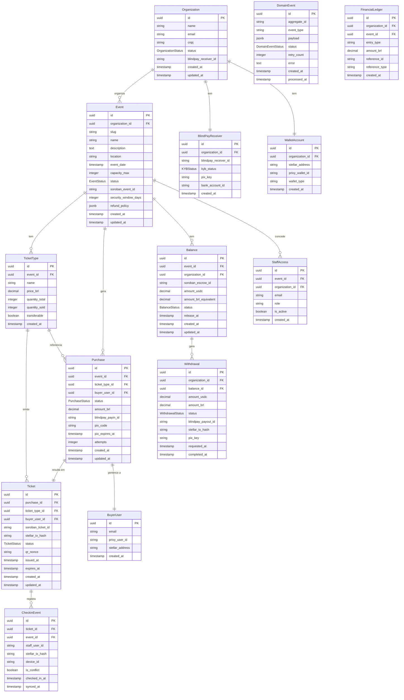

# Modelo de Dados — GreetUp Access

Dados pessoais e financeiros ficam **exclusivamente off-chain** (PostgreSQL).  
A blockchain armazena apenas dados não-pessoais: IDs, endereços de wallet, status e timestamps.

---

## Enums de Estado

```typescript
enum PurchaseStatus {
  INITIATED            // compra criada, aguardando payin
  AWAITING_PAYMENT     // payin criado no BlindPay, aguardando Pix
  PAYMENT_CONFIRMED    // webhook payin.completed recebido
  TICKET_ISSUED        // mint no Soroban concluído
  PAYMENT_FAILED       // pagamento falhou
  PAYMENT_EXPIRED      // QR Code Pix expirou
  PAYMENT_REFUNDED     // reembolso executado
}

enum TicketStatus {
  RESERVED             // reservado antes do pagamento
  ISSUED               // emitido, válido para uso
  CHECKED_IN           // utilizado no evento
  CANCELLED            // cancelado pelo produtor
  REFUNDED             // reembolsado
  EXPIRED              // expirado sem uso
  INVALIDATED          // invalidado administrativamente
}

enum BalanceStatus {
  PENDING_SETTLEMENT   // aguardando evento + janela de segurança
  BLOCKED              // bloqueado (cancelamento ou disputa)
  AVAILABLE            // disponível para retirada
  WITHDRAWN            // retirado
  REFUNDED             // usado para reembolso
  DISPUTED             // em disputa
}

enum WithdrawalStatus {
  WITHDRAW_REQUESTED      // produtor solicitou
  WITHDRAW_ESCROW_DONE    // release on-chain executado
  WITHDRAW_PAYOUT_SENT    // payout BlindPay iniciado
  WITHDRAWN               // Pix enviado ao produtor
  WITHDRAW_FAILED         // falha após tentativas de recovery
}

enum KYBStatus {
  PENDING
  APPROVED
  REJECTED
  UNDER_REVIEW
}

enum OrganizationStatus {
  PENDING_KYB
  ACTIVE
  SUSPENDED
}

enum EventStatus {
  DRAFT
  PUBLISHED
  CANCELLED
  POSTPONED
  COMPLETED
}

enum DomainEventStatus {
  PENDING      // aguardando publicação pelo OutboxRelay
  PROCESSED    // publicado no BullMQ com sucesso
  FAILED       // falhou após tentativas
}
```

---

## ERD — Entidades Principais



---

## Dados On-chain vs Off-chain

### Dados armazenados on-chain (Soroban)

| Campo | Entidade | Descrição |
|---|---|---|
| `event_id` | TicketContract | ID único do evento |
| `ticket_id` | TicketContract | ID único do ingresso (imutável) |
| `ticket_type` | TicketContract | Tipo do ingresso |
| `owner_address` | TicketContract | Endereço Stellar do comprador |
| `status` | TicketContract | Estado atual do ingresso |
| `transferable` | TicketContract | Regra de transferibilidade |
| `capacity_max` | TicketContract | Capacidade máxima do evento |
| `checkin_timestamp` | TicketContract | Timestamp do check-in |
| `metadata_hash` | TicketContract | Hash SHA-256 dos metadados off-chain |
| `escrow_id` | EscrowContract | ID do escrow |
| `seller_address` | EscrowContract | Endereço Stellar do produtor |
| `amount_usdc` | EscrowContract | Valor custodiado em USDC |
| `balance_status` | EscrowContract | Estado financeiro |
| `release_at` | EscrowContract | Timestamp de liberação |
| `last_release_ts` | EscrowContract | Rate limit de retirada |

### Dados armazenados off-chain (PostgreSQL)

| Categoria | Exemplos |
|---|---|
| Dados pessoais do comprador | nome, email, telefone, CPF |
| Dados do produtor | razão social, CNPJ, responsável |
| Dados bancários | chave Pix, conta bancária |
| Dados de pagamento | valor BRL, taxas, comprovantes |
| Histórico financeiro | ledger de entradas/saídas |
| Logs e auditoria | ações de usuários, estados anteriores |
| Detalhes de suporte | disputas, reembolsos, contatos |

---

## Índices Críticos

```sql
-- Idempotência de webhooks
CREATE UNIQUE INDEX idx_purchase_blindpay_payin_id
  ON purchases(blindpay_payin_id)
  WHERE blindpay_payin_id IS NOT NULL;

-- Busca de eventos Outbox pendentes pelo relay
CREATE INDEX idx_domain_events_pending
  ON domain_events(status, created_at)
  WHERE status = 'PENDING';

-- Tenant isolation (complementa o RLS)
CREATE INDEX idx_events_org_id ON events(organization_id);
CREATE INDEX idx_tickets_event_id ON tickets(event_id);
CREATE INDEX idx_balances_event_org ON balances(event_id, organization_id);

-- Rate limit de retirada (complementa o rate limit on-chain)
CREATE INDEX idx_withdrawals_org_status
  ON withdrawals(organization_id, status)
  WHERE status IN ('WITHDRAW_REQUESTED', 'WITHDRAW_ESCROW_DONE', 'WITHDRAW_PAYOUT_SENT');

-- QR Code lookup (validação offline usa nonce)
CREATE UNIQUE INDEX idx_tickets_qr_nonce ON tickets(qr_nonce);
```

---

## Row-Level Security (RLS)

```sql
-- Habilitar RLS em todas as tabelas de tenant
ALTER TABLE events ENABLE ROW LEVEL SECURITY;
ALTER TABLE tickets ENABLE ROW LEVEL SECURITY;
ALTER TABLE purchases ENABLE ROW LEVEL SECURITY;
ALTER TABLE balances ENABLE ROW LEVEL SECURITY;
ALTER TABLE withdrawals ENABLE ROW LEVEL SECURITY;

-- Policy padrão — aplicada automaticamente em toda query
CREATE POLICY tenant_isolation ON events
  USING (organization_id = current_setting('app.current_organization_id')::uuid);

-- Replicar para cada tabela com organization_id
-- (as tabelas que acessam via JOIN herdam o isolamento da tabela raiz)
```

---

## Ledger Financeiro (append-only)

O `FinancialLedger` é uma tabela de auditoria imutável. Nenhuma linha é alterada ou deletada.

```typescript
// entry_type values
type LedgerEntryType =
  | 'payment_received'       // Pix confirmado, valor atribuído ao produtor
  | 'greetup_fee'            // Taxa da plataforma deduzida
  | 'blindpay_fee'           // Taxa BlindPay deduzida
  | 'balance_released'       // Saldo liberado para retirada
  | 'balance_blocked'        // Saldo bloqueado
  | 'withdrawal_initiated'   // Retirada iniciada
  | 'withdrawal_completed'   // Retirada concluída
  | 'refund_issued'          // Reembolso emitido
  | 'dispute_hold'           // Saldo em disputa
  | 'dispute_resolved'       // Disputa resolvida
```

Todo estado de saldo é derivado da sequência de entradas no ledger — rastreabilidade completa e irrefutável.
