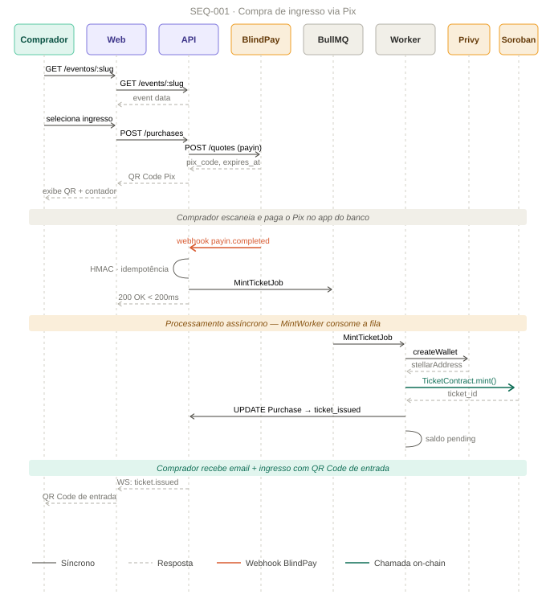
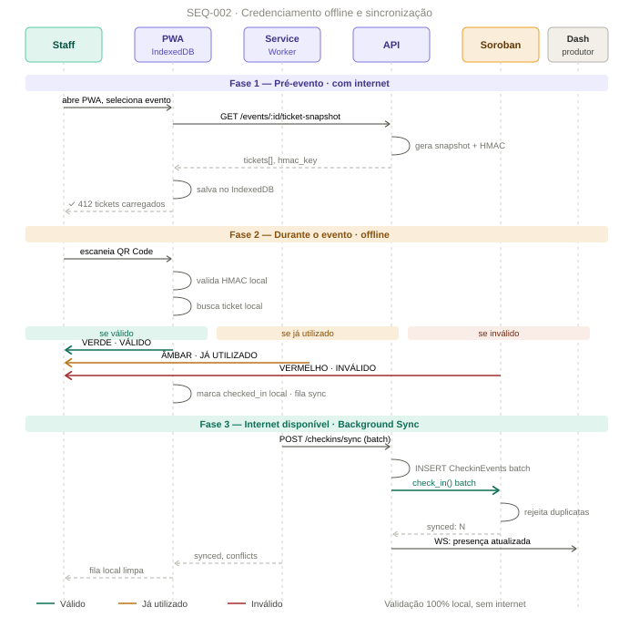
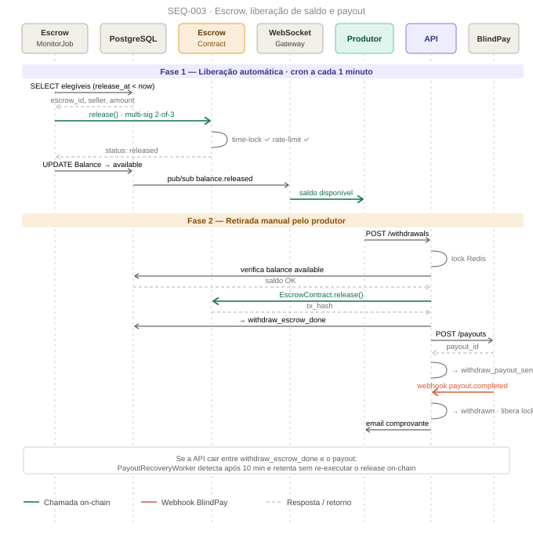

# Diagramas de Sequência — Access

> ⚠️ **Documento anterior à revisão de arquitetura de 20/08/2026.** Parte do conteúdo está
> superada (escrow, Treasury própria, KMS, CQRS, WebSocket). Em qualquer conflito, vale o
> [`MVP-REVISADO.md`](../06-sdd/MVP-REVISADO.md). Será revisado junto com as SPECs de cada bloco.

Diagramas como SVG estático em `docs/02-project/diagrams/` — renderizam corretamente no GitHub, no VS Code e em qualquer visualizador.

---

## SEQ-001 — Compra de Ingresso via Pix

**Pontos críticos representados:**
- O endpoint de webhook responde em menos de 200ms — o processamento pesado (mint) acontece de forma assíncrona no worker, nunca dentro do handler do webhook
- HMAC e verificação de idempotência acontecem antes de qualquer outra ação
- A criação da wallet Privy e o mint no Soroban só acontecem depois da confirmação do pagamento — nunca antes
- O saldo do produtor é registrado como `pending_settlement` no mesmo passo em que o ticket é emitido — nunca em passos separados que possam divergir

Especificação de implementação completa: `docs/06-sdd/SPEC-005-purchase.md` e `SPEC-007-mint-worker.md`.

---

## SEQ-002 — Credenciamento Offline e Sincronização

**Pontos críticos representados:**
- Toda validação da Fase 2 acontece localmente no dispositivo do staff, sem qualquer chamada de rede
- Os três resultados possíveis (válido, já utilizado, inválido) são tratados como casos de primeira classe, não como exceção
- A sincronização da Fase 3 acontece em batch, não ticket por ticket — reduz custo de transação Soroban
- Conflitos de check-in (dois devices offline escaneando o mesmo ticket) são esperados e tratados explicitamente, não são bugs

Especificação de implementação completa: `docs/06-sdd/SPEC-009-checkin.md`.

---

## SEQ-003 — Escrow, Liberação de Saldo e Payout

**Pontos críticos representados:**
- A Fase 1 (liberação automática) roda via cron independente de qualquer ação do produtor — o saldo fica disponível sozinho quando a janela de segurança expira
- A Fase 2 (retirada manual) tem lock Redis antes de qualquer operação, e o lock é liberado mesmo em caso de erro
- O release on-chain acontece antes do payout BlindPay — nunca em paralelo, nunca depois
- Se o processo falhar entre o release e o payout, o `PayoutRecoveryWorker` retoma exatamente daquele ponto, sem repetir a operação on-chain

Especificação de implementação completa: `docs/06-sdd/SPEC-010-finance.md` e `SPEC-011-withdrawal.md`.

---

## Convenções usadas nos diagramas

| Elemento visual | Significado |
|---|---|
| Linha sólida cinza-escura | Chamada síncrona |
| Linha tracejada cinza-clara | Resposta / retorno |
| Linha laranja sólida | Webhook recebido de sistema externo (BlindPay) |
| Linha verde sólida | Chamada on-chain (Soroban) |
| Faixa colorida horizontal | Separador de fase do fluxo |
| Auto-mensagem (curva pequena) | Processamento interno do próprio participante |

Essas convenções são consistentes em todos os diagramas de sequência do projeto.
